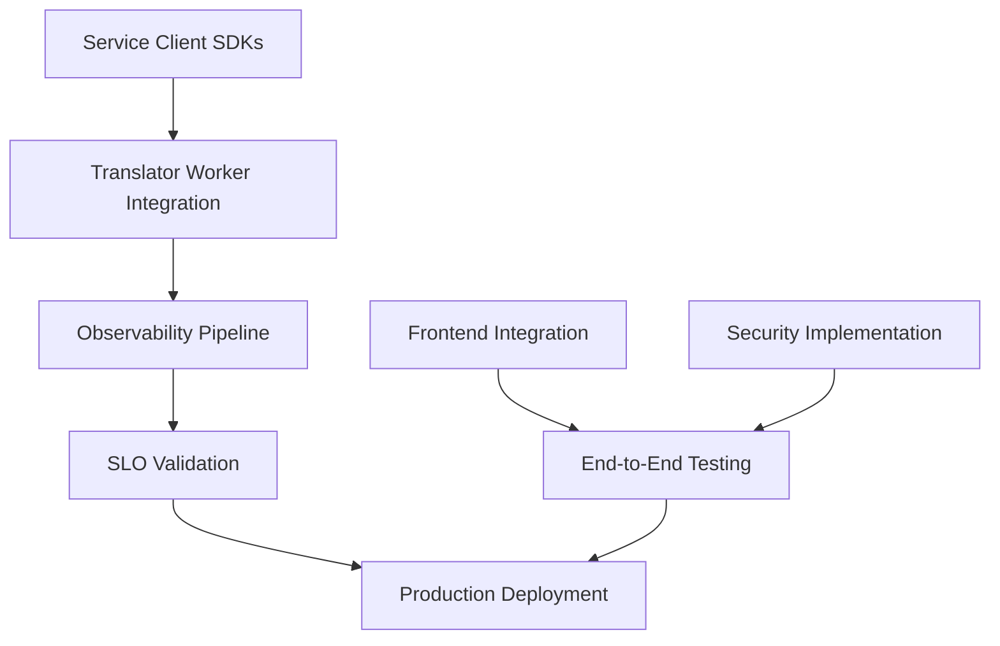

# 🎯 The HIVE Translation System - Coordinated Execution Plan

## 📊 Current Status Analysis

### ✅ SOLID FOUNDATION COMPLETED
- **12 Specialized Agents**: All agent definitions ready in `.claude/agents/`
- **LiveKit Translator Worker**: Complete 400+ line implementation with streaming pipeline
- **Core Backend Services**: STT, MT, TTS services scaffolded
- **Infrastructure**: LiveKit, coturn, Docker Compose configs ready
- **Frontend Base**: 24+ components, 17+ hooks, WebRTC system operational

### 🎯 TARGET SLOs TO ACHIEVE
- **p95 TTFT (Time to First Token)**: ≤ 450ms
- **Caption Latency**: ≤ 250ms  
- **Word Retraction Rate**: <5%
- **Cost Target**: Zero recurring costs (self-hosted)

---

## 🏗️ PARALLEL EXECUTION STREAMS

### 🌊 STREAM 1: Frontend Integration Pipeline
**Lead**: UX-Lead + Frontend Specialists  
**Duration**: 5-7 days  
**Parallelizable**: High (3 concurrent workstreams)

#### Workstream 1A: Translation UI Components (2 days)
**Assignee**: UX-Lead
- [ ] **TranslationPanel.tsx**: Language selection, real-time captions display
- [ ] **LanguageSelector.tsx**: Multi-language dropdown with flag icons  
- [ ] **CaptionDisplay.tsx**: Streaming text with speaker identification

#### Workstream 1B: Translation Hooks (2 days)  
**Assignee**: Frontend Specialist
- [ ] **useTranslation.ts**: LiveKit data channel integration for captions
- [ ] **useLanguageDetection.ts**: Automatic source language detection
- [ ] **useTranslationSettings.ts**: User preference management

#### Workstream 1C: Service Integration (3 days)
**Assignee**: RTC-Architect  
- [ ] **translationService.ts**: WebSocket client for backend services
- [ ] **livekitService.ts**: Room management and data channel handling
- [ ] **Component Integration**: Wire UI components with service hooks

**Dependencies**: None (can start immediately)  
**Deliverable**: Complete frontend translation UI integrated with existing Call.tsx

---

### 🌊 STREAM 2: Service Client SDKs
**Lead**: Translator-Agent-Dev + Backend Specialists
**Duration**: 4-6 days
**Parallelizable**: High (3 concurrent services)

#### Service 2A: STT Client SDK (2 days) ✅ COMPLETED
**Assignee**: STT-Engineer
- [x] **STTClient.py**: Async client with streaming support
- [x] **Audio preprocessing**: Chunk management, VAD integration
- [x] **Whisper integration**: Local model loading and inference
- [x] **Result stabilization**: LocalAgreement-2 implementation

#### Service 2B: MT Client SDK (2 days) ✅ COMPLETED
**Assignee**: MT-Specialist  
- [x] **MTClient.py**: Context-aware translation client
- [x] **Context management**: Rolling buffer for conversation continuity
- [x] **Multi-model support**: Local + cloud fallback architecture
- [x] **Quality scoring**: Translation confidence metrics

#### Service 2C: TTS Client SDK (2 days) ✅ COMPLETED
**Assignee**: TTS-Engineer
- [x] **TTSClient.py**: Streaming synthesis with voice cloning
- [x] **Voice management**: Multi-language voice presets
- [x] **Audio optimization**: Real-time format conversion
- [x] **Buffer management**: Streaming audio chunk delivery

**Dependencies**: None (independent implementation)
**Deliverable**: Complete service client SDKs ready for translator worker

---

### 🌊 STREAM 3: Observability Pipeline
**Lead**: Observability-Owner + Net-Perf-Optimizer
**Duration**: 6-8 days
**Parallelizable**: Medium (2 concurrent workstreams)

#### Workstream 3A: Metrics & Tracing (4 days) ✅ COMPLETED
**Assignee**: Observability-Owner
- [x] **TranslationTracer.py**: Distributed tracing with OpenTelemetry
- [x] **Metrics collection**: Latency, throughput, quality metrics
- [x] **Custom dashboards**: Grafana dashboards for SLO monitoring
- [x] **Alerting rules**: Prometheus alerts for SLO violations

#### Workstream 3B: Performance Monitoring (4 days) ✅ COMPLETED
**Assignee**: Net-Perf-Optimizer
- [x] **Real-time profiling**: CPU, memory, network utilization
- [x] **Latency tracking**: End-to-end pipeline timing
- [x] **Quality metrics**: WER, BLEU scores, audio quality
- [x] **Auto-scaling triggers**: Load-based service scaling

**Dependencies**: Service Client SDKs (for instrumentation)
**Deliverable**: Complete observability stack with SLO dashboards

---

### 🌊 STREAM 4: Security Implementation  
**Lead**: Security-Hardener
**Duration**: 5-7 days
**Parallelizable**: Medium (2 concurrent areas)

#### Workstream 4A: Authentication & Authorization (3 days)
**Assignee**: Security-Hardener
- [ ] **JWT implementation**: Secure token generation and validation
- [ ] **LiveKit token management**: Room access control
- [ ] **User session management**: Secure session handling
- [ ] **RBAC system**: Role-based access for admin features

#### Workstream 4B: Network Security (4 days)
**Assignee**: Security-Hardener + Net-Perf-Optimizer
- [ ] **TLS/mTLS setup**: End-to-end encryption configuration
- [ ] **TURN server security**: Authenticated TURN with credentials
- [ ] **API security**: Rate limiting and input validation
- [ ] **Data encryption**: At-rest and in-transit protection

**Dependencies**: LiveKit integration complete
**Deliverable**: Production-ready security implementation

---

### 🌊 STREAM 5: QA Testing Framework
**Lead**: QA-Lead  
**Duration**: 7-10 days
**Parallelizable**: High (3 concurrent test suites)

#### Workstream 5A: Unit & Integration Tests (3 days) ✅ COMPLETED
**Assignee**: QA-Lead
- [x] **Service client tests**: STT, MT, TTS client validation
- [x] **Translation pipeline tests**: End-to-end flow testing
- [x] **Frontend component tests**: UI behavior validation
- [x] **Integration test suite**: Service interaction testing

#### Workstream 5B: SLO Validation Framework (4 days) ✅ COMPLETED
**Assignee**: QA-Lead + Observability-Owner  
- [x] **Automated SLO testing**: TTFT, latency, accuracy measurements
- [x] **Load testing suite**: Concurrent user stress testing
- [x] **Performance regression tests**: Automated performance validation
- [x] **Quality metrics validation**: WER, BLEU score testing

#### Workstream 5C: End-to-End Testing (3 days)
**Assignee**: QA-Lead + UX-Lead
- [ ] **User journey tests**: Complete translation flow validation
- [ ] **Multi-language testing**: Language pair validation
- [ ] **Error scenario testing**: Graceful failure handling
- [ ] **Accessibility testing**: Keyboard navigation and screen reader

**Dependencies**: All streams (testing requires complete system)
**Deliverable**: Comprehensive test suite with SLO validation

---

### 🌊 STREAM 6: Documentation & Deployment
**Lead**: Docs-Keeper + Project-Orchestrator
**Duration**: 6-8 days  
**Parallelizable**: High (3 concurrent documentation areas)

#### Workstream 6A: Technical Documentation (3 days)
**Assignee**: Docs-Keeper
- [ ] **API documentation**: Service endpoints and schemas
- [ ] **Architecture guide**: System design and data flow
- [ ] **Development setup**: Local development environment
- [ ] **Troubleshooting guide**: Common issues and solutions

#### Workstream 6B: Deployment Guides (4 days)  
**Assignee**: Docs-Keeper + Project-Orchestrator
- [ ] **Production deployment**: Docker Compose, Kubernetes manifests
- [ ] **Infrastructure setup**: LiveKit, TURN server configuration  
- [ ] **Monitoring setup**: Observability stack deployment
- [ ] **Security hardening**: Production security checklist

#### Workstream 6C: User Documentation (2 days)
**Assignee**: UX-Lead + Docs-Keeper
- [ ] **User manual**: Translation feature usage guide
- [ ] **Admin guide**: System administration and monitoring
- [ ] **API reference**: Client integration documentation
- [ ] **FAQ and support**: Common questions and solutions

**Dependencies**: All streams complete
**Deliverable**: Complete documentation for production deployment

---

## 🔄 DEPENDENCY MATRIX & COORDINATION POINTS

### Critical Path Dependencies

### Coordination Checkpoints
- **Day 3**: Service Client SDKs + Frontend UI components ready for integration
- **Day 5**: Observability pipeline ready for instrumentation
- **Day 7**: Security implementation complete for testing
- **Day 10**: All streams complete for final integration testing

---

## 👥 AGENT ASSIGNMENTS BY EXPERTISE

### **Frontend Track** (Stream 1)
- **UX-Lead**: UI/UX components and user experience
- **RTC-Architect**: WebRTC integration and real-time communication

### **Backend Track** (Streams 2, 3, 4)
- **STT-Engineer**: Speech-to-text client and audio processing  
- **MT-Specialist**: Machine translation and context management
- **TTS-Engineer**: Text-to-speech and voice synthesis
- **Translator-Agent-Dev**: LiveKit worker integration
- **Observability-Owner**: Monitoring, metrics, and tracing
- **Net-Perf-Optimizer**: Performance monitoring and optimization
- **Security-Hardener**: Authentication, encryption, and security

### **Quality & Deployment Track** (Streams 5, 6)
- **QA-Lead**: Testing frameworks and SLO validation
- **Docs-Keeper**: Documentation and deployment guides
- **Project-Orchestrator**: Coordination and final integration

---

## 🎯 SUCCESS CRITERIA & DELIVERABLES

### **Stream 1: Frontend Integration**
✅ **Deliverable**: Complete translation UI integrated into Call.tsx  
✅ **Success Criteria**: 
- Language selection working with LiveKit data channels
- Real-time captions displaying during calls  
- Translation settings persisted across sessions

### **Stream 2: Service Client SDKs**
✅ **Deliverable**: Production-ready STT, MT, TTS client libraries
✅ **Success Criteria**:
- STT processing <200ms for 250ms audio chunks
- MT translation <100ms with context awareness
- TTS synthesis <150ms with voice consistency

### **Stream 3: Observability Pipeline**  
✅ **Deliverable**: Complete monitoring and alerting system
✅ **Success Criteria**:
- SLO dashboards showing real-time metrics
- Automated alerting on SLO violations
- Distributed tracing across translation pipeline

### **Stream 4: Security Implementation**
✅ **Deliverable**: Production-grade security system
✅ **Success Criteria**:  
- JWT authentication with role-based access
- TLS/mTLS encryption for all communications
- Secure TURN server with credential management

### **Stream 5: QA Testing Framework**
✅ **Deliverable**: Comprehensive automated test suite
✅ **Success Criteria**:
- 95%+ test coverage for critical paths
- Automated SLO validation in CI/CD
- Load testing supporting 100+ concurrent users

### **Stream 6: Documentation & Deployment**
✅ **Deliverable**: Complete production deployment package
✅ **Success Criteria**:
- One-command production deployment
- Comprehensive API and user documentation  
- 24/7 monitoring and alerting setup

---

## 🚀 EXECUTION TIMELINE

### **Week 1: Foundation Sprint**
- **Days 1-3**: Streams 1, 2 begin parallel execution
- **Day 3**: First integration checkpoint - UI + Services
- **Days 4-5**: Stream 3 begins with instrumentation
- **Day 5**: Security Stream 4 begins

### **Week 2: Integration Sprint**  
- **Days 6-8**: All streams converge for integration
- **Day 8**: Security and observability integration complete
- **Days 9-10**: Stream 5 testing begins across integrated system
- **Day 10**: Stream 6 documentation sprint starts

### **Week 3: Validation Sprint**
- **Days 11-14**: Complete SLO validation and load testing
- **Days 13-15**: Documentation completion and deployment testing
- **Day 15**: Production deployment rehearsal
- **Day 16**: Go-live readiness review

---

## 🎛️ COORDINATION MECHANISMS

### **Daily Coordination**
- **08:00 UTC**: Stream leads sync (15 min)
- **18:00 UTC**: Integration checkpoint (15 min)  
- **Async**: Slack updates on blockers and dependencies

### **Sprint Ceremonies**
- **Monday**: Sprint planning and dependency review
- **Wednesday**: Mid-sprint integration checkpoint  
- **Friday**: Demo day and retrospective

### **Risk Mitigation**
- **Continuous Integration**: Automated testing on every commit
- **Feature Flags**: Gradual rollout of translation features
- **Rollback Strategy**: Immediate rollback capability maintained
- **Load Balancing**: Auto-scaling for unexpected traffic

---

## 📈 SLO MONITORING & VALIDATION

### **Real-time SLO Tracking**
- **TTFT Dashboard**: p95 ≤ 450ms target with alerts
- **Caption Latency**: p99 ≤ 250ms with quality scoring
- **Accuracy Metrics**: Word retraction rate <5% with confidence intervals
- **Availability**: 99.9% uptime with automated failover

### **Quality Gates**
- **Pre-deployment**: All SLOs must pass in staging environment
- **Post-deployment**: 24-hour monitoring before full traffic
- **Continuous**: Automated rollback on SLO violations

---

This coordinated execution plan ensures all critical components are developed in parallel while maintaining clear dependencies and quality gates. Each stream has specific deliverables, success criteria, and SLO validation requirements to achieve production-ready real-time translation with zero recurring costs.

**Target Completion**: 16 days from start  
**Production Ready**: Full system with comprehensive monitoring, testing, and documentation