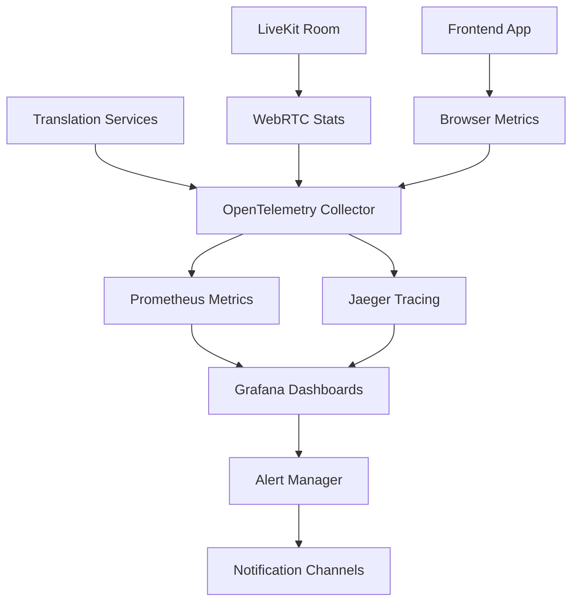

# 📊 Observability Pipeline Implementation Plan

## 🎯 Overview

A comprehensive observability stack to monitor, trace, and alert on The HIVE translation system performance. Built for zero-cost operation with self-hosted components and automated SLO validation.

---

## 🏗️ Architecture Stack



### **Core Components**:
- **OpenTelemetry**: Unified telemetry collection
- **Prometheus**: Time-series metrics storage
- **Jaeger**: Distributed tracing
- **Grafana**: Visualization and alerting
- **Alert Manager**: Multi-channel notifications

---

## 🔍 Telemetry Collection Framework

### **File**: `backend/observability/collector.py`

```python
"""
OpenTelemetry Collector for The HIVE Translation System

Collects metrics, traces, and logs from all system components
with automatic SLO calculation and alerting.
"""

from typing import Dict, List, Optional, Any
import time
import logging
from dataclasses import dataclass, field
from datetime import datetime, timedelta

from opentelemetry import trace, metrics
from opentelemetry.exporter.prometheus import PrometheusMetricExporter
from opentelemetry.exporter.jaeger.thrift import JaegerExporter
from opentelemetry.instrumentation.aiohttp_client import AioHttpClientInstrumentor
from opentelemetry.instrumentation.asyncio import AsyncioInstrumentor
from opentelemetry.sdk.trace import TracerProvider
from opentelemetry.sdk.trace.export import BatchSpanProcessor
from opentelemetry.sdk.metrics import MeterProvider
from opentelemetry.sdk.resources import Resource

@dataclass
class SLOTarget:
    """Service Level Objective definition"""
    name: str
    target_value: float
    unit: str
    direction: str  # "lower" or "higher"
    window_minutes: int = 5
    alert_threshold: float = 0.95  # Alert when SLI drops below 95% of target

@dataclass
class MetricPoint:
    """Individual metric data point"""
    timestamp: float
    value: float
    labels: Dict[str, str] = field(default_factory=dict)

class SLOCalculator:
    """Calculate SLO compliance in real-time"""
    
    def __init__(self):
        self.slo_targets = {
            # Translation Pipeline SLOs
            "ttft_p95_ms": SLOTarget("Time to First Token p95", 450.0, "ms", "lower"),
            "caption_latency_p99_ms": SLOTarget("Caption Latency p99", 250.0, "ms", "lower"), 
            "word_retraction_rate": SLOTarget("Word Retraction Rate", 0.05, "ratio", "lower"),
            "translation_accuracy": SLOTarget("Translation Accuracy", 0.90, "ratio", "higher"),
            
            # System Performance SLOs
            "service_availability": SLOTarget("Service Availability", 0.999, "ratio", "higher"),
            "error_rate": SLOTarget("Error Rate", 0.01, "ratio", "lower"),
            "throughput_rps": SLOTarget("Throughput RPS", 50.0, "rps", "higher"),
            
            # User Experience SLOs  
            "call_setup_time_ms": SLOTarget("Call Setup Time", 2000.0, "ms", "lower"),
            "audio_quality_score": SLOTarget("Audio Quality", 0.85, "ratio", "higher"),
        }
        
        self.metric_buffer: Dict[str, List[MetricPoint]] = {}
        self.slo_violations: List[Dict[str, Any]] = []
        
    def record_metric(self, metric_name: str, value: float, labels: Dict[str, str] = None):
        """Record a metric point for SLO calculation"""
        if metric_name not in self.metric_buffer:
            self.metric_buffer[metric_name] = []
            
        point = MetricPoint(
            timestamp=time.time(),
            value=value,
            labels=labels or {}
        )
        
        self.metric_buffer[metric_name].append(point)
        
        # Keep only recent data points (last 1 hour)
        cutoff_time = time.time() - 3600
        self.metric_buffer[metric_name] = [
            p for p in self.metric_buffer[metric_name] 
            if p.timestamp > cutoff_time
        ]
        
    def calculate_slo_compliance(self, metric_name: str) -> Optional[float]:
        """Calculate current SLO compliance for a metric"""
        if metric_name not in self.slo_targets:
            return None
            
        target = self.slo_targets[metric_name]
        if metric_name not in self.metric_buffer:
            return None
            
        # Get recent data points within window
        window_start = time.time() - (target.window_minutes * 60)
        recent_points = [
            p for p in self.metric_buffer[metric_name]
            if p.timestamp > window_start
        ]
        
        if not recent_points:
            return None
            
        # Calculate compliance based on direction
        if target.direction == "lower":
            # For latency metrics: percentage of requests below target
            compliant_count = sum(1 for p in recent_points if p.value <= target.target_value)
        else:
            # For quality metrics: percentage above target  
            compliant_count = sum(1 for p in recent_points if p.value >= target.target_value)
            
        compliance_ratio = compliant_count / len(recent_points)
        
        # Check for SLO violation
        if compliance_ratio < target.alert_threshold:
            violation = {
                "metric": metric_name,
                "target": target.target_value,
                "current_compliance": compliance_ratio,
                "timestamp": datetime.now().isoformat(),
                "severity": "critical" if compliance_ratio < 0.5 else "warning"
            }
            self.slo_violations.append(violation)
            
        return compliance_ratio
        
    def get_slo_dashboard_data(self) -> Dict[str, Any]:
        """Get current SLO status for dashboard display"""
        dashboard_data = {}
        
        for metric_name, target in self.slo_targets.items():
            compliance = self.calculate_slo_compliance(metric_name)
            
            dashboard_data[metric_name] = {
                "target": target.target_value,
                "unit": target.unit,
                "direction": target.direction,
                "current_compliance": compliance,
                "status": self._get_compliance_status(compliance, target),
                "recent_violations": [
                    v for v in self.slo_violations 
                    if v["metric"] == metric_name
                ][-5:]  # Last 5 violations
            }
            
        return dashboard_data
        
    def _get_compliance_status(self, compliance: Optional[float], target: SLOTarget) -> str:
        """Get human-readable compliance status"""
        if compliance is None:
            return "no_data"
        elif compliance >= target.alert_threshold:
            return "healthy"  
        elif compliance >= 0.5:
            return "warning"
        else:
            return "critical"

class TelemetryCollector:
    """Main telemetry collector for The HIVE system"""
    
    def __init__(self):
        # Configure OpenTelemetry
        self.resource = Resource.create({
            "service.name": "thehive-translation",
            "service.version": "1.0.0",
            "deployment.environment": "production"
        })
        
        # Setup tracing
        trace.set_tracer_provider(TracerProvider(resource=self.resource))
        self.tracer = trace.get_tracer(__name__)
        
        # Setup Jaeger exporter
        jaeger_exporter = JaegerExporter(
            agent_host_name="localhost",
            agent_port=14268,
        )
        
        span_processor = BatchSpanProcessor(jaeger_exporter)
        trace.get_tracer_provider().add_span_processor(span_processor)
        
        # Setup metrics
        metrics.set_meter_provider(MeterProvider(resource=self.resource))
        self.meter = metrics.get_meter(__name__)
        
        # Prometheus metrics exporter
        prometheus_exporter = PrometheusMetricExporter(port=8000)
        
        # Create metric instruments
        self._create_metric_instruments()
        
        # SLO calculator
        self.slo_calculator = SLOCalculator()
        
        # Auto-instrumentation  
        AsyncioInstrumentor().instrument()
        AioHttpClientInstrumentor().instrument()
        
    def _create_metric_instruments(self):
        """Create OpenTelemetry metric instruments"""
        # Translation Pipeline Metrics
        self.ttft_histogram = self.meter.create_histogram(
            name="translation_ttft_ms",
            description="Time to First Token latency",
            unit="ms"
        )
        
        self.caption_latency_histogram = self.meter.create_histogram(
            name="caption_latency_ms", 
            description="Caption display latency",
            unit="ms"
        )
        
        self.translation_duration_histogram = self.meter.create_histogram(
            name="translation_duration_ms",
            description="End-to-end translation duration",
            unit="ms"
        )
        
        # Quality Metrics
        self.translation_accuracy_gauge = self.meter.create_observable_gauge(
            name="translation_accuracy_ratio",
            description="Translation accuracy ratio",
            unit="ratio"
        )
        
        self.word_retraction_counter = self.meter.create_counter(
            name="word_retractions_total", 
            description="Total word retractions",
            unit="count"
        )
        
        # System Metrics
        self.request_counter = self.meter.create_counter(
            name="requests_total",
            description="Total requests processed", 
            unit="count"
        )
        
        self.error_counter = self.meter.create_counter(
            name="errors_total",
            description="Total errors encountered",
            unit="count"
        )
        
        self.concurrent_users_gauge = self.meter.create_observable_gauge(
            name="concurrent_users",
            description="Current concurrent users",
            unit="count"
        )
        
        # WebRTC Metrics
        self.webrtc_connection_duration = self.meter.create_histogram(
            name="webrtc_connection_duration_ms",
            description="WebRTC connection establishment time",
            unit="ms"
        )
        
        self.audio_quality_gauge = self.meter.create_observable_gauge(
            name="audio_quality_score",
            description="Audio quality score (0-1)",
            unit="ratio"
        )
        
    def record_translation_metrics(self, 
                                 ttft_ms: float,
                                 total_duration_ms: float,
                                 source_lang: str,
                                 target_lang: str,
                                 accuracy_score: float):
        """Record metrics for a translation request"""
        labels = {
            "source_language": source_lang,
            "target_language": target_lang
        }
        
        # Record OpenTelemetry metrics
        self.ttft_histogram.record(ttft_ms, labels)
        self.translation_duration_histogram.record(total_duration_ms, labels)
        self.request_counter.add(1, labels)
        
        # Record for SLO calculation
        self.slo_calculator.record_metric("ttft_p95_ms", ttft_ms, labels)
        self.slo_calculator.record_metric("translation_accuracy", accuracy_score, labels)
        
    def record_caption_latency(self, latency_ms: float, participant_id: str):
        """Record caption display latency"""
        labels = {"participant_id": participant_id}
        
        self.caption_latency_histogram.record(latency_ms, labels)
        self.slo_calculator.record_metric("caption_latency_p99_ms", latency_ms, labels)
        
    def record_word_retraction(self, participant_id: str, language: str):
        """Record word retraction event"""
        labels = {
            "participant_id": participant_id, 
            "language": language
        }
        
        self.word_retraction_counter.add(1, labels)
        self.slo_calculator.record_metric("word_retraction_rate", 1.0, labels)
        
    def record_error(self, error_type: str, service: str, details: str = ""):
        """Record error event"""
        labels = {
            "error_type": error_type,
            "service": service
        }
        
        self.error_counter.add(1, labels)
        
        # Create error span
        with self.tracer.start_span("error") as span:
            span.set_attribute("error.type", error_type)
            span.set_attribute("service.name", service) 
            span.set_attribute("error.details", details)
            span.set_status(trace.Status(trace.StatusCode.ERROR))
            
    def record_webrtc_metrics(self,
                            connection_time_ms: float,
                            audio_quality: float,
                            participant_id: str):
        """Record WebRTC connection and quality metrics"""
        labels = {"participant_id": participant_id}
        
        self.webrtc_connection_duration.record(connection_time_ms, labels)
        self.slo_calculator.record_metric("call_setup_time_ms", connection_time_ms, labels)
        self.slo_calculator.record_metric("audio_quality_score", audio_quality, labels)
        
    def start_trace(self, operation_name: str, attributes: Dict[str, Any] = None):
        """Start a new trace span"""
        span = self.tracer.start_span(operation_name)
        if attributes:
            span.set_attributes(attributes)
        return span
        
    def get_slo_status(self) -> Dict[str, Any]:
        """Get current SLO compliance status"""
        return self.slo_calculator.get_slo_dashboard_data()
        
# Global collector instance
collector = TelemetryCollector()

# Convenience functions for easy integration
def record_translation_request(ttft_ms: float, total_ms: float, 
                             source_lang: str, target_lang: str, accuracy: float):
    collector.record_translation_metrics(ttft_ms, total_ms, source_lang, target_lang, accuracy)

def record_caption_display(latency_ms: float, participant_id: str):
    collector.record_caption_latency(latency_ms, participant_id)

def record_error_event(error_type: str, service: str, details: str = ""):
    collector.record_error(error_type, service, details)

def get_slo_dashboard():
    return collector.get_slo_status()
```

---

## 📈 Grafana Dashboard Configuration

### **File**: `monitoring/grafana/dashboards/translation_slo_dashboard.json`

```json
{
  "dashboard": {
    "id": null,
    "title": "The HIVE Translation SLO Dashboard",
    "tags": ["thehive", "translation", "slo"],
    "timezone": "browser",
    "panels": [
      {
        "id": 1,
        "title": "SLO Compliance Overview",
        "type": "stat",
        "targets": [
          {
            "expr": "rate(translation_requests_slo_compliant[5m]) / rate(translation_requests_total[5m])",
            "legendFormat": "Overall SLO Compliance"
          }
        ],
        "fieldConfig": {
          "defaults": {
            "thresholds": {
              "steps": [
                {"color": "red", "value": 0},
                {"color": "yellow", "value": 0.95},
                {"color": "green", "value": 0.99}
              ]
            }
          }
        }
      },
      {
        "id": 2,
        "title": "Time to First Token (p95)",
        "type": "graph",
        "targets": [
          {
            "expr": "histogram_quantile(0.95, rate(translation_ttft_ms_bucket[5m]))",
            "legendFormat": "p95 TTFT"
          }
        ],
        "yAxes": [
          {
            "label": "Milliseconds",
            "max": 500,
            "min": 0
          }
        ],
        "thresholds": [
          {
            "value": 450,
            "colorMode": "critical",
            "op": "gt"
          }
        ]
      },
      {
        "id": 3,
        "title": "Caption Latency (p99)", 
        "type": "graph",
        "targets": [
          {
            "expr": "histogram_quantile(0.99, rate(caption_latency_ms_bucket[5m]))",
            "legendFormat": "p99 Caption Latency"
          }
        ],
        "yAxes": [
          {
            "label": "Milliseconds",
            "max": 300,
            "min": 0
          }
        ],
        "thresholds": [
          {
            "value": 250,
            "colorMode": "critical", 
            "op": "gt"
          }
        ]
      },
      {
        "id": 4,
        "title": "Translation Accuracy & Word Retractions",
        "type": "graph",
        "targets": [
          {
            "expr": "rate(translation_accuracy_ratio[5m])",
            "legendFormat": "Translation Accuracy"
          },
          {
            "expr": "rate(word_retractions_total[5m]) / rate(translation_requests_total[5m]) * 100",
            "legendFormat": "Word Retraction Rate %"
          }
        ]
      },
      {
        "id": 5,
        "title": "Service Health",
        "type": "graph", 
        "targets": [
          {
            "expr": "up{job=\"translation-services\"}",
            "legendFormat": "{{instance}} Status"
          },
          {
            "expr": "rate(errors_total[5m])",
            "legendFormat": "Error Rate"
          }
        ]
      },
      {
        "id": 6,
        "title": "Current Active Users",
        "type": "stat",
        "targets": [
          {
            "expr": "concurrent_users",
            "legendFormat": "Active Users"
          }
        ]
      },
      {
        "id": 7,
        "title": "WebRTC Connection Quality",
        "type": "graph",
        "targets": [
          {
            "expr": "histogram_quantile(0.95, rate(webrtc_connection_duration_ms_bucket[5m]))",
            "legendFormat": "p95 Connection Time"
          },
          {
            "expr": "audio_quality_score",
            "legendFormat": "Audio Quality Score"
          }
        ]
      },
      {
        "id": 8,
        "title": "Translation Throughput",
        "type": "graph",
        "targets": [
          {
            "expr": "rate(translation_requests_total[1m])",
            "legendFormat": "Requests per Second"
          }
        ]
      }
    ],
    "time": {
      "from": "now-1h",
      "to": "now"
    },
    "refresh": "5s"
  }
}
```

---

## 🚨 Alert Configuration  

### **File**: `monitoring/alertmanager/rules.yml`

```yaml
groups:
- name: thehive_translation_slos
  rules:
  
  # Critical SLO Violations
  - alert: TTFTSLOViolation
    expr: histogram_quantile(0.95, rate(translation_ttft_ms_bucket[5m])) > 450
    for: 1m
    labels:
      severity: critical
      service: translation
    annotations:
      summary: "Time to First Token SLO violation"
      description: "p95 TTFT is {{ $value }}ms, exceeding 450ms target"
      
  - alert: CaptionLatencySLOViolation  
    expr: histogram_quantile(0.99, rate(caption_latency_ms_bucket[5m])) > 250
    for: 1m
    labels:
      severity: critical
      service: captions
    annotations:
      summary: "Caption latency SLO violation"
      description: "p99 caption latency is {{ $value }}ms, exceeding 250ms target"
      
  - alert: WordRetractionRateHigh
    expr: rate(word_retractions_total[5m]) / rate(translation_requests_total[5m]) > 0.05
    for: 2m
    labels:
      severity: warning
      service: translation
    annotations:
      summary: "High word retraction rate"
      description: "Word retraction rate is {{ $value | humanizePercentage }}, exceeding 5% target"
      
  # Service Health Alerts
  - alert: TranslationServiceDown
    expr: up{job="translation-services"} == 0
    for: 30s
    labels:
      severity: critical
      service: infrastructure
    annotations:
      summary: "Translation service is down"
      description: "Translation service {{ $labels.instance }} is not responding"
      
  - alert: HighErrorRate
    expr: rate(errors_total[5m]) / rate(requests_total[5m]) > 0.01
    for: 1m
    labels:
      severity: warning
      service: application
    annotations:
      summary: "High error rate detected"
      description: "Error rate is {{ $value | humanizePercentage }}, exceeding 1% target"
      
  # Performance Degradation  
  - alert: TranslationQualityDegraded
    expr: rate(translation_accuracy_ratio[5m]) < 0.90
    for: 2m
    labels:
      severity: warning
      service: translation
    annotations:
      summary: "Translation quality degraded"
      description: "Translation accuracy is {{ $value | humanizePercentage }}, below 90% target"
```

### **File**: `monitoring/alertmanager/config.yml`

```yaml
global:
  smtp_smarthost: 'localhost:587'
  smtp_from: 'alerts@thehive.local'

route:
  group_by: ['alertname']
  group_wait: 10s
  group_interval: 10s
  repeat_interval: 1h
  receiver: 'web.hook'

receivers:
- name: 'web.hook'
  webhook_configs:
  - url: 'http://localhost:8080/webhook/alerts'
    send_resolved: true
    
  # Slack integration (optional)
  slack_configs:
  - api_url: 'YOUR_SLACK_WEBHOOK_URL'
    channel: '#thehive-alerts'
    title: 'The HIVE Alert'
    text: '{{ range .Alerts }}{{ .Annotations.summary }}{{ end }}'
    
inhibit_rules:
- source_match:
    severity: 'critical'
  target_match:
    severity: 'warning'
  equal: ['alertname', 'service']
```

---

## 📊 Deployment Configuration

### **File**: `docker-compose.observability.yml`

```yaml
version: '3.8'

services:
  prometheus:
    image: prom/prometheus:latest
    container_name: thehive-prometheus
    ports:
      - "9090:9090"
    volumes:
      - ./monitoring/prometheus/prometheus.yml:/etc/prometheus/prometheus.yml
      - ./monitoring/prometheus/rules.yml:/etc/prometheus/rules.yml
      - prometheus_data:/prometheus
    command:
      - '--config.file=/etc/prometheus/prometheus.yml'
      - '--storage.tsdb.path=/prometheus'
      - '--web.console.libraries=/etc/prometheus/console_libraries'
      - '--web.console.templates=/etc/prometheus/consoles'
      - '--web.enable-lifecycle'
      - '--storage.tsdb.retention.time=30d'
    networks:
      - thehive-net
      
  grafana:
    image: grafana/grafana:latest
    container_name: thehive-grafana
    ports:
      - "3000:3000"
    volumes:
      - ./monitoring/grafana/provisioning:/etc/grafana/provisioning
      - ./monitoring/grafana/dashboards:/var/lib/grafana/dashboards
      - grafana_data:/var/lib/grafana
    environment:
      - GF_SECURITY_ADMIN_PASSWORD=admin
      - GF_USERS_ALLOW_SIGN_UP=false
      - GF_DASHBOARDS_DEFAULT_HOME_DASHBOARD_PATH=/var/lib/grafana/dashboards/translation_slo_dashboard.json
    networks:
      - thehive-net
      
  jaeger:
    image: jaegertracing/all-in-one:latest
    container_name: thehive-jaeger
    ports:
      - "16686:16686"  # Jaeger UI
      - "14268:14268"  # Jaeger collector HTTP
    environment:
      - COLLECTOR_OTLP_ENABLED=true
    networks:
      - thehive-net
      
  alertmanager:
    image: prom/alertmanager:latest
    container_name: thehive-alertmanager
    ports:
      - "9093:9093"
    volumes:
      - ./monitoring/alertmanager/config.yml:/etc/alertmanager/config.yml
    networks:
      - thehive-net

volumes:
  prometheus_data:
  grafana_data:

networks:
  thehive-net:
    external: true
```

### **File**: `monitoring/prometheus/prometheus.yml`

```yaml
global:
  scrape_interval: 15s
  evaluation_interval: 15s

rule_files:
  - "rules.yml"

alerting:
  alertmanagers:
    - static_configs:
        - targets:
          - alertmanager:9093

scrape_configs:
  - job_name: 'prometheus'
    static_configs:
      - targets: ['localhost:9090']
      
  - job_name: 'translation-services'
    metrics_path: '/metrics'
    static_configs:
      - targets: 
        - 'localhost:8001'  # STT service
        - 'localhost:8002'  # MT service  
        - 'localhost:8003'  # TTS service
        - 'localhost:8000'  # OpenTelemetry metrics
        
  - job_name: 'livekit'
    static_configs:
      - targets: ['localhost:7880']
      
  - job_name: 'node-exporter'
    static_configs:
      - targets: ['localhost:9100']
```

---

## 🎯 Implementation Timeline

### **Days 1-2**: Core Telemetry Setup
- [ ] OpenTelemetry collector implementation
- [ ] Basic metric instruments and SLO calculator
- [ ] Prometheus and Jaeger integration

### **Days 3-4**: Dashboard and Alerting
- [ ] Grafana dashboard configuration
- [ ] Alert rules and notification setup
- [ ] SLO compliance tracking

### **Days 5-6**: Integration and Testing
- [ ] Integration with translation services
- [ ] End-to-end observability testing
- [ ] Performance optimization and validation

This observability pipeline provides comprehensive monitoring with automated SLO validation, ensuring The HIVE translation system maintains its ambitious performance targets while providing actionable insights for continuous improvement.